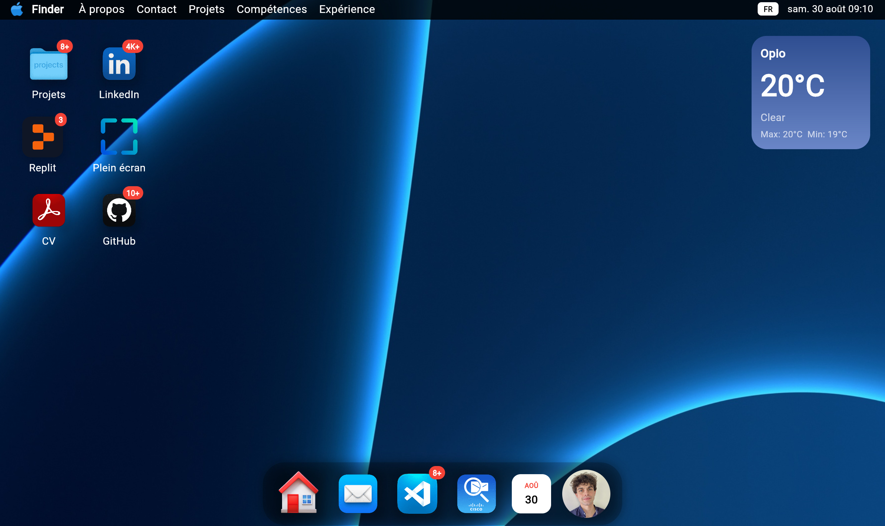
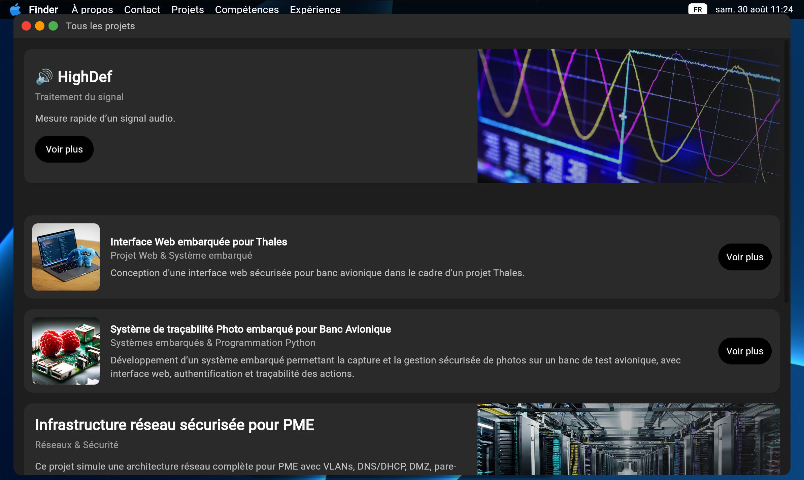
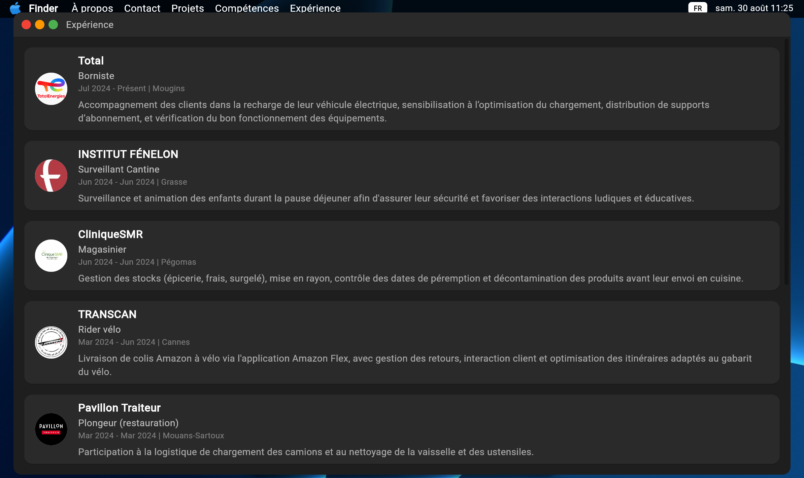

# Portfolio Website – Jeremy

  
  
  

---

## 🇫🇷 Description (FR)  

Projet réalisé dans le cadre du **BUT Réseaux & Télécom (parcours Cybersécurité)**.  
L’objectif était de développer un **site web portfolio** permettant de :  
- Présenter mon profil académique et professionnel  
- Mettre en valeur mes projets en **réseaux & cybersécurité**  
- Servir de vitrine interactive pour mes candidatures et stages  

### 🎯 Objectifs du projet  
- Créer un site web responsive et moderne avec Flutter Web  
- Centraliser mes projets, expériences et liens professionnels  
- Démontrer mes compétences en développement et cybersécurité  
- Offrir un accès direct à mon CV et à mes contacts  

### 🛠️ Fonctionnalités  
- Page d’accueil avec présentation personnelle  
- Section projets (réseaux, cybersécurité, développement)  
- Lien vers mon CV et mes profils pro (LinkedIn, GitHub)  
- Interface Material Design responsive  

### 📂 Contenu du dépôt  
- `/lib` → code source Flutter Web  
- `/assets` → images, icônes, données statiques  
- `/docs` → captures d’écran du site  
- `README.md` → résumé et présentation du projet  

### 👨‍💻 Compétences développées  
- Développement web moderne avec **Flutter Web**  
- Structuration de projet et gestion avec GitHub  
- Présentation professionnelle en ligne  
- Mise en avant d’un parcours orienté **cybersécurité**  

---

## 🇬🇧 Description (EN)  

Project carried out as part of the **Bachelor in Networks & Telecommunications (Cybersecurity track)**.  
The goal was to build a **portfolio website** to:  
- Showcase my academic & professional background  
- Highlight my **networking & cybersecurity projects**  
- Serve as an interactive showcase for internship & job applications  

### 🎯 Project objectives  
- Develop a responsive and modern website with Flutter Web  
- Centralize projects, experiences, and professional links  
- Demonstrate both software & cybersecurity skills  
- Provide direct access to resume and contact info  

### 🛠️ Features  
- Homepage with personal presentation  
- Projects section (networking, cybersecurity, development)  
- Links to CV and professional profiles (LinkedIn, GitHub)  
- Responsive Material Design UI  

### 📂 Repository content  
- `/lib` → Flutter Web source code  
- `/assets` → images, icons, static data  
- `/docs` → website screenshots  
- `README.md` → summary and project presentation  

### 👨‍💻 Skills developed  
- Modern web development with **Flutter Web**  
- Project structure & GitHub best practices  
- Professional self-presentation online  
- Emphasis on **cybersecurity-focused background**  

---

📸 *Aperçu du site / Website preview:*  

  
  
  

---
